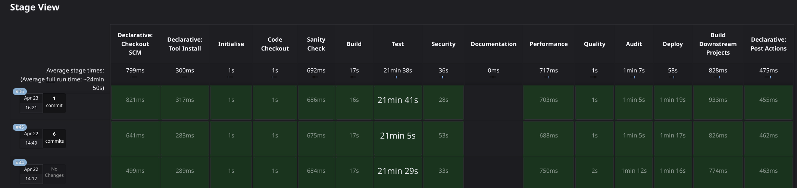

# Snomed Jenkins - A fully automated CI/CD pipeline implementation

<!-- TOC -->
* [Snomed Jenkins - A fully automated CI/CD pipeline implementation](#snomed-jenkins---a-fully-automated-cicd-pipeline-implementation)
* [Summary](#summary)
  * [What each step does](#what-each-step-does)
* [Configuration](#configuration)
  * [Master Code Estate Spreadsheet](#master-code-estate-spreadsheet)
    * [Spreadsheet column and in column delimiters](#spreadsheet-column-and-in-column-delimiters)
  * [Environment variables](#environment-variables)
* [Docker](#docker)
* [Architecture](#architecture)
  * [Jenkins Pipelines](#jenkins-pipelines)
    * [Build step:](#build-step)
    * [Security step:](#security-step)
  * [Shell Scripts](#shell-scripts)
    * [000_Config.sh](#000_configsh)
* [Jenkins jobs starting with underscore](#jenkins-jobs-starting-with-underscore)
  * [\_CleanSpreadsheetCache\_](#_cleanspreadsheetcache_)
  * [\_DailyAnalysis\_](#_dailyanalysis_)
  * [\_PipelineCreationJob\_](#_pipelinecreationjob_)
    * [jobMake.groovy](#jobmakegroovy)
* [How to test and update the scripts](#how-to-test-and-update-the-scripts)
* [Jenkins Plugins](#jenkins-plugins)
* [Credentials](#credentials)
* [Linux box libraries installed](#linux-box-libraries-installed)
* [GITHUB authentication](#github-authentication)
<!-- TOC -->

This project contains all code for the Jenkins build pipelines for Snomed CT,
except for the pipelines and configuration, which are controlled by Jenkins itself for security.

This CI/CD process is designed from the ground up to by fully automated.
The only action that needs to occur is maintenance of the __Master Code Estate spreadsheet__.
This spreadsheet is all powerful and controls what is built and how.

This project is designed to be:

* Low cost (all open source).
* Easy to maintain.
* Fully automated.
* Fully self-managing.
* Consistency, every job type, even if there are thousands will run the same. All you need is a row in the master spreadsheet.
* Powerful.
* Efficient.
* Configurable.
* Feature rich.
* Modern.

The builds are controlled by several mechanisms working together (detailed below):

* Pipelines—located in Jenkins
* Groovy scripts
* Shell scripts

This results in a system, which:

* Creates __and__ deletes the build projects in jenkins.
* Control what steps are run and when.
* Automatically create tickets in Jira for new CVE's that occur overnight.
* Automatically create and update GitHub build hooks, so that a git push will cause a build to run.
* Build maven, Gradle and UI projects.
* Push to DockerHub
* Push to Nexus
* Run Cypress tests and publish reports, images and video results of the tests.
* Collate various reports
* Manage branches, their creation and deletion.
* and so on.

# Summary

In summary:

* Jenkins runs the jobs and contains configuration, secrets, and the pipeline definitions.
* This project is checkedout by the _PipelineCreationJob_ project and, which runs various scripts, but mainly
  the `scripts/jobMake.groovy`.
* The `scripts/jobMake.groovy` script uses groovy to create and configure projects according to
  the [Master Code Estate Spreadsheet](#master-code-estate-spreadsheet).
* These jobs look after themselves.
* Each job runs within a pipeline, the pipeline contains a series of steps, the actions performed by a step and dictated
  by the shell scripts located in the `scripts` folder.

## What each step does
Depending on the pipeline the shell scripts for each step do the following tasks.

* [000_Config.sh](https://github.com/IHTSDO/snomed-jenkins/blob/main/scripts/000_Config.sh) - Used by steps below to get config of project from spreadsheet.
* [010_Initialize.sh](https://github.com/IHTSDO/snomed-jenkins/blob/main/scripts/010_Initialize.sh) - Check gradle/maven version and output `set`.
* [020_SanityCheck.sh](https://github.com/IHTSDO/snomed-jenkins/blob/main/scripts/020_SanityCheck.sh) - Check for license file, if a maven project there is a pom, run [gitleaks](https://github.com/gitleaks/gitleaks) and so on.
* [500_Build.sh](https://github.com/IHTSDO/snomed-jenkins/blob/main/scripts/500_Build.sh) - Use the build tool maven/gradle to build the project.
* [510_Test.sh](https://github.com/IHTSDO/snomed-jenkins/blob/main/scripts/510_Test.sh) - Run unit tests.
* [600_Security.sh](https://github.com/IHTSDO/snomed-jenkins/blob/main/scripts/600_Security.sh) - Run [OWASP dependency check](https://owasp.org/www-project-dependency-check/).
* [610_Documentation.sh](https://github.com/IHTSDO/snomed-jenkins/blob/main/scripts/610_Documentation.sh) - Use [Doxygen](https://www.doxygen.nl/) to generate code documentation.
* [620_Performance.sh](https://github.com/IHTSDO/snomed-jenkins/blob/main/scripts/620_Performance.sh) - Run performance tests.
* [630_Quality.sh](https://github.com/IHTSDO/snomed-jenkins/blob/main/scripts/630_Quality.sh) - Generate code coverage report with [Jacoco](https://www.jacoco.org/jacoco/).
* [640_EndToEndTest.sh](https://github.com/IHTSDO/snomed-jenkins/blob/main/scripts/640_EndToEndTest.sh) - Run [Cypress](https://www.cypress.io) end to end tests.
* [650_Audit.sh](https://github.com/IHTSDO/snomed-jenkins/blob/main/scripts/650_Audit.sh) - Run code quality with [SonarQube](https://www.sonarsource.com/products/sonarqube/).
* [660_Deploy.sh](https://github.com/IHTSDO/snomed-jenkins/blob/main/scripts/660_Deploy.sh) - Deploy to nexus and if the project is configured with [maven/jib plugin](https://github.com/GoogleContainerTools/jib) to dockerhub.
  * Note that the deployment location depends on the branch name:
    * If branch name is `master`/`main`/`release-candidate` artifact is deployed to `releases`
    * If branch name is `develop` or ends in `nexus` the artifact is deployed to `snapshots`
  * __Branches with any other name are NOT deployed to nexus__.
* [800_TriggerDownstream.sh](https://github.com/IHTSDO/snomed-jenkins/blob/main/scripts/800_TriggerDownstream.sh) - Start any downstream projects.
* [900_Cleanup.sh](https://github.com/IHTSDO/snomed-jenkins/blob/main/scripts/900_Cleanup.sh) - Save disc space on jenkins if needed.
* [950_SelectCommsChannel.sh](https://github.com/IHTSDO/snomed-jenkins/blob/main/scripts/950_SelectCommsChannel.sh) - Library used by pipelines to send messages to the correct destination.

# Configuration

Configuration for the build process is stored in two locations:

## Master Code Estate Spreadsheet

The primary spreadsheet controls, which jobs are built and how. This spreadsheet contains a list of projects, 1 per
line.
The columns define the information for the project, which inturn dictatates how the project is build.
The column headings are
(note these are EXACT NAMES AND ORDER MUST NOT BE CHANGED as they are read by [000_Config](#000_configsh)
and [jobMake.groovy](#jobmakegroovy)):

* Jenkins Build Enabled
* Project Name
* GroupId:ArtifactID
* Build Tool
* Language
* Project Type
* Deploy Enabled
* Slack Channel
* Notified Users
* Uses BOM?
* Snomed Dependencies
* Owner
* Notes

The master code estate spreadsheet is stored in the Jenkins environment variable `SNOMED_SPREADSHEET_URL` i.e. something
like
`https://docs.google.com/spreadsheets/SOME_GOOGLE_DOC_ID`.

__BE CAREFUL EDITING THIS SPREADSHEET__

For example, DO NOT edit the column titles/order etc., it will break the build process.
Google does keep an edit history, so you can always rewind any changes (and find who broke the spreadsheet).

### Spreadsheet column and in column delimiters

The master spreadsheet is used by groovy and bash files. This limits the complexity of parsing the spreadsheet. So
simple string splitting is used. To simplify this tabs are used in dividing the columns. Note the "Notified Users"
and "Snomed Dependencies" columns can be further divided, these are split internally with the pipe symbol.

## Environment variables

The environment variables are located here: https://YOUR_JENKINS_HOST/manage/configure - access is restricted.

| Name                       | Value                                                      | Description                                                                                                                                       |
|:---------------------------|:-----------------------------------------------------------|---------------------------------------------------------------------------------------------------------------------------------------------------|
| DOWNSTREAM_ENABLED         | `true`/`false`                                             | Downstream spawning of tasks                                                                                                                      |
| LICENSE_EXPECTED_CHECK_SUM | md5 checksum of your LICENSE.md files.                     | Checksum of generic LICENSE file, without year line.                                                                                              |
| SCRIPTS_PATH               | `/var/lib/jenkins/workspace/_PipelineCreationJob_/scripts` | Where the scripts can be found.                                                                                                                   |
| SNOMED_SPREADSHEET_URL     | `https://docs.google.com/spreadsheets/SOME_GOOGLE_DOC_ID`  | Where the master code spreadsheet is located.                                                                                                     |
| SNOMED_TOOLS_URL           | `SOME_URL`                                                 | Used to link systems together.                                                                                                                    |
| SONAR_URL                  | `https://YOUR_SONAR_HOST/`                                 | SonarQube host URL.                                                                                                                               |
| VERBOSE                    | `true`/`false`                                             | Slightly more output from jobs, for example see [010_Initialize.sh](https://github.com/IHTSDO/snomed-jenkins/blob/main/scripts/010_Initialize.sh) |

# Docker

This project contains a subfolder for a local installation of Jenkins and SonarQube.
This enables you to run Jenkins locally to perform builds and test any changes you may wish to try.
Find the documentation in this [README.md](docker/README.md).

# Architecture

The system consists of a standard Jenkins installation, with some extra
plugins [see the plugins section](#jenkins-plugins)

We have tried to keep the use of `groovy` to a minimum,
all build steps are simple, short bash files, which do one step within a pipeline; these are located in the `scripts`
folder.

## Jenkins Pipelines

The builds are controlled by **pipelines**:

There are several pipelines, the main one
being [SnomedPipeline_Maven_Jdk17](https://github.com/IHTSDO/snomed-jenkins/blob/main/pipelines/SnomedPipeline_Maven_Jdk17.groovy)
which is the pipeline executed for java 17 maven project (as specified in
the [Master Spreadsheet](#master-code-estate-spreadsheet))

Each pipeline step decides what to run and what the steps are. These can be seen in any build and look like this.



The pipelines themselves have as little code as possible (they are
a [Groovy DSL](https://www.jenkins.io/doc/pipeline/steps/job-dsl/)). The code for each step is located in the
[Shell Scripts, see section](#shell-scripts).

### Build step:

* Shell scripts starting with a number are called from the pipelines roughly in numerical order.
    - `000_Config.sh` is an exception [see this section](#000_configsh)
* The remaining shell scripts are part of the normal build process.
* The groovy scripts are all part of the control of Jenkins using groovy and the
  DSL: https://plugins.jenkins.io/job-dsl/

Within the pipelines there are a series of steps. For example the pipelines build step looks like this.

So this step simply runs the shell
script [500_Build.sh](https://github.com/IHTSDO/snomed-jenkins/blob/main/scripts/500_Build.sh) always.

```groovy
stage('Build') { steps { sh "../_PipelineCreationJob_/scripts/500_Build.sh" } }
```

### Security step:

Here is a more complex step. There are 3 pieces of logic:

1. `when/anyOf`: It only runs this for the branches listed, i.e. `main/master/develop/release-candidate`.
2. `steps`: What to run, in this case the shell `script 600_Security.sh`.
3. `post`: On success publish a report.

Also since for this particular scenario, we do not want the build to stop on failure there are two extra arguments/code:

1. For the steps we have `600_Security.sh || true`. This is shell magic for always return true even if the shell script
   fails.
2. For the `post/success` for extra protection with have `stopBuild: false`.

```groovy
stage('Security') {
    when {
        anyOf {
            branch 'main'
            branch 'master'
            branch 'develop'
            branch 'release-candidate'
        }
    }
    steps {
        sh "../_PipelineCreationJob_/scripts/600_Security.sh || true"
    }
    post {
        success {
            dependencyCheckPublisher(stopBuild: false)
        }
    }
}
```

## Shell Scripts

Within the pipelines there are a series of steps, most of the run a single shell script. These are in
the `scripts` folder. Most of these scripts are of the form, decide what the projects and steps
characteristics are and then run the appropriate commands.
For example for [500_Build.sh](https://github.com/IHTSDO/snomed-jenkins/blob/main/scripts/500_Build.sh) looks like
this (at the time of writing).

```shell
#!/usr/bin/env bash                                       # Its a bog standard bash shell script.
source "$SCRIPTS_PATH/000_Config.sh"                      # Loads the configuration from the master code spreadsheet.
figlet -w 500 "Build"                                     # Print big obvious banner in the log.
 
case $SNOMED_PROJECT_LANGUAGE in                          # Decide which language we are building.
    Cypress)                                              # Language is Cypress so use npm and ng to build.
        npm install
        ng build
        ;;
    *)                                                    # Here onwards, if the build tool is Maven use that, if Gradle use that, if none then echo a message, anything else fail the build.
        case $SNOMED_PROJECT_BUILD_TOOL in
            maven)
                mvn -U clean package -DskipTests -Ddependency-check.skip=true
                ;;
            gradle)
                ./gradlew clean build buildDeb -x test -x spotbugsMain -x spotbugsTest -x checkstyleTest -x checkstyleMain
                ;;
            none)
                echo "No build tool required."
                ;;
            *)
                echo "Unknown build tool: ${SNOMED_PROJECT_BUILD_TOOL}"
                exit 1
                ;;
        esac
    ;;
esac
```

The shell scripts are numbered from 010 onwards, representing the rough order they are run, and the first number
representing the section the script belongs in, broadly speaking.

### 000_Config.sh

The [000_Config.sh](https://github.com/IHTSDO/snomed-jenkins/blob/main/scripts/000_Config.sh) script provides a
mechanism for all of the shell scripts to have access to the configuration spreadsheet. To do
this it:

* Downloads the spreadsheet (there is a simple cache mechanism in place)
* Parses the spreadsheet and assigns a series shell variables which other scripts can use.
    * So from the spreadsheet the name column will be assigned to the variable `$SNOMED_PROJECT_NAME`

# Jenkins jobs starting with underscore

All jobs starting with an underscore are special. The underscore protects them from being deleted
for easy identification and auto-management.
These jobs have to be manually created and configured, all other jobs are created/delete automatically.

**ALL OTHER JOBS ON THE SYSTEM ARE AUTOMATICALLY MANAGED/DELETED -
SO IF YOU EDIT THEM YOU WILL LOSE YOUR CHANGES THE NEXT TIME THE MANAGEMENT JOB RUNS.**

## \_CleanSpreadsheetCache\_

This a convenience job which does the following:

* Removes the cached/downloaded spreadsheet file, this is useful to makesure latest spreadsheet changes are loaded:
* Uses the linux [set](https://cheat.sh/set) command to output all environment variables, this can be useful for
  debugging.

This job is run manually as and when required.

## \_DailyAnalysis\_

This job runs on a schedule. It does the following:

```shell
# Search for CVE's in project reports and generate tsv file.
../_PipelineCreationJob_/jobMakeCveTable.sh tsv

# Analyse project pom.xml files and generate PNG and SVG images.
../_PipelineCreationJob_/jobMakeDependencyGraph.sh

# Create new Jira tickets if required.
../_PipelineCreationJob_/createCveJiraTickets.sh

# Use TSV file and existing Jira tickets to create HTML report.
../_PipelineCreationJob_/jobMakeCveTable.sh html
```

## \_PipelineCreationJob\_

This job runs on a schedule (or if you update the spreadsheet you can run it manually). It runs 3 scripts:

* `jobMake.groovy` - See below.
* `approveAllScripts.groovy`  - There is a security mechanism in Jenkins, this is needed to approve scripts
  automatically.
* `jobMakeCreateGithubWebHook.sh` - This uses the github API to make build webhooks for the projects if needed in
  github.

### jobMake.groovy

The creation of the pipelines is automated for each project. This is performed by the largest/most complex part of this
snomed-jenkins project.

https://github.com/IHTSDO/snomed-jenkins/blob/main/scripts/jobMake.groovy

This script is written in Groovy, again with some DSL extensions provided by the Jenkins Job DSL plugin. The pseudo code
for the script is:

```text
Download the configuration spreadsheet

for each row of the spreadsheet
  Call makeJobs, if the project is enabled

function makeJob:
  Add information to a hook file (used to make the build hooks in github)
  Create a pipeline for the project
  Create a nightly security check job for appropriate projects
  Create a nightly e2e job for appropriate projects
```

# How to test and update the scripts

If you update a script you can test it by updating the corresponding script on the jenkins box,
bear-in-mind that any updates will be removed when this task next updates.

The easiest was is to upate within this project,
commit and then run the [\_PipelineCreationJob\_](#_pipelinecreationjob_),
this will download the latest scripts and when a pipeline is run your new code will be executed.

# Jenkins Plugins

The following is a list of the plugins we use in our Jenkins instance.

* AnsiColor
* Ant
* Config file provider
* Doxygen
* Gradle
* Groovy
* HTML Publisher
* JaCoCo
* Job DSL
* Maven Integration
* OWASP Dependency-Check
* Pipeline
* Dashboard ViewVersion
* Multibranch Scan Webhook Trigger
* Theme
    - http://afonsof.com/jenkins-material-theme/
    - https://devopscube.com/setup-custom-materialized-ui-theme-jenkins/#:~:text=Uploading%20Custom%20CSS%20TO%20Jenkins%20Server&text=Step%201%3A%20Login%20to%20your,layout%20inside%20the%20userContent%20directory.&text=Step%203%3A%20cd%20into%20the,css%20file.
    - Jenkins simple theme plugin
    - Dark Theme
    - Material Theme
    - Set CSS TO this:

```css
.logo img {
    content: url(/userContent/layout/logo.png);
}

#jenkins-name-icon {
    display: none;
}

.logo:after {
    content: 'Snomed Jenkins Dev Server';
    font-size: 35px;
    font-family: Arial, Helvetica, sans-serif;
    margin-left: 20px;
    margin-right: 12px;
    line-height: 40px;
}
```

# Credentials

* These are all setup here: https://YOUR_JENKINS_HOST/manage/credentials/ - access is restricted.
* You can see in the pipelines how these are passed
* The shell scripts and pipelines use these secrets to perform their tasks.

# Linux box libraries installed

* JDK* - 11 and 17 for example, depending on your source.
* [doxygen](https://cheat.sh/doxygen)
* [figlet](https://cheat.sh/figlet)
* [graphviz/dot](https://cheat.sh/dot)
* [bc](https://cheat.sh/bc)
* [xmlstarlet](https://github.com/tldr-pages/tldr/blob/main/pages/common/xmlstarlet.md)
* [xmllint (installed in libxml2-utils)](https://cheat.sh/xmllint)
* nodejs, npm and npx with:
    - sudo tar -C /usr/local --strip-components 1 -xvf node-v20.9.0-linux-x64.tar.xz
* [xfvb](https://en.wikipedia.org/wiki/Xvfb) Virtual graphics buffer.
* [libgbm-dev](https://github.com/robclark/libgbm) generic buffer management API

# GITHUB authentication

Github required a key for access, this was created and used as follows:

* Create of ed25519 SSH key pair

```bash
ssh-keygen -t ed25519
```

* Add public key to github
* Add private key to Jenkins credentials
* Then on command line as jenkins download a repo and accept the fingerprint, this will create a `known_hosts` file in
  the `.ssh` directory.
